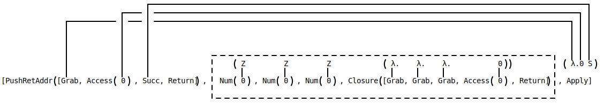

## Practice run with Arithmetic Expressions:

Invented by Xavier Leroy, Zinc is an "abstract machine" capable of representing any computation. An abstract machine is just a specification of a computing system - other examples are the lambda calculus, turing machines, and cellular automata. 

It turns out that a pretty good way of implementing the lambda calculus (LC) is to just convert an LC term to a list of Zinc instructions. To understand how this works, I'll use the example that everyone uses, which is converting arithmetic expressions to reverse polish notation.

### The Arithmetic Expression Language

Let's imagine an arithmetic expression language, which we'll define in ReasonML like this:

```reason
type lang =
  | Num(int) 
  | Add(lang, lang)
  | Sub(lang, lang);


// Examples:
let one = Num(1);
let three = Num(3);
let ten = Num(10);
let ten_plus_three_minus_one = Add(ten, Sub(three, one));
```

You could easily imagine a "direct" interpreter of these expressions. It would look something like this:

```reason
let rec interpret = l => {
  switch (l) {
  | Num(i) => i
  | Add(a, b) => interpret(a) + interpret(b)
  | Sub(a, b) => interpret(a) - interpret(b)
  };
};


// Example:

let () = Printf.printf("%d\n", interpret(ten_plus_three_minus_one)); 
// 12
```

### Reverse Polish Notation

And that would be fine for most purposes. However, for the sake of illustration, let's convert it to another way of writing arithmetic expressions that can be evaluated slightly more efficiently, called reverse polish notation (RPN). The nice thing about RPN is that it's non-hierarchial and doesn't require parentheses, making it a closer approximation to how computers work.

How RPN works is simple. This is the definition of an RPN instruction:

```reason
type rpn_instruction =
  | Num(int)
  | Add
  | Sub;
type rpn = list(rpn_instruction);
```

A value of type `rpn` can express anything our `lang` type could. For example, `Add(ten, Sub(three, one))` becomes `[Num(10), Num(1), Num(3), Sub, Add]`. To evaluate it, you need two things:

1) An "instruction pointer" telling you the next instruction to execute.

2) A stack to hold intermediate values. 

Here are the rules. `Num(x)` adds `x` to the stack. `Add` pops two values off the stack, adds them, then pushes the result back onto the stack. `Sub` does the same thing, except subtracting instead of adding. By example:

```
instructions: [Num(10), Num(1), Num(3), Sub, Add]
                ☝️
stack:        []
```

`Num(10)`, so we push `10` onto the stack, and advance the instruction pointer:

```
instructions: [Num(10), Num(1), Num(3), Sub, Add]
                         ☝️
stack:        [10]
```

Same for `Num(1)`,

```
instructions: [Num(10), Num(1), Num(3), Sub, Add]
                                  ☝️
stack:        [1, 10]
```

and `Num(3)`.

```
instructions: [Num(10), Num(1), Num(3), Sub, Add]
                                        ☝️
stack:        [3, 1, 10]
```

Now the instruction pointer is pointing to `Sub`, so we pop the top two numbers off the stack, subtract them, then push the result back onto the stack. The top two numbers are `3` and `1`, and `3-1` is `2`, so that turns the stack into `[2, 10]`. 

```
instructions: [Num(10), Num(1), Num(3), Sub, Add]
                                             ☝️
stack:        [2, 10]
```

Now, same thing for `Add`. Pop the top two numbers off the stack (`2` and `10`), add them, then push the result onto the stack.


```
instructions: [Num(10), Num(1), Num(3), Sub, Add]
                                                ☝️
stack:        [12]
```

And our instruction pointer has reached the end of the program, so we're done! The only thing on the stack is `12`, so that's the result of our computation. 

### Converting Between Arithmetic Expressions and RPN

To get started, I'm going to put `rpn` and `lang` in separate modules.

```reason
module Arithmetic = {
  type t =
    | Num(int)
    | Add(t, t)
    | Sub(t, t);
};

module Rpn = {
  type instruction =
    | Num(int)
    | Add
    | Sub;
  type t = list(instruction);
};
```

Now, we need to find some way to convert between `Arithmetic.t` and `RPN.t`. The function is going to look something like this:

```reason
let rec arithmetic_to_rpn = l =>
  switch (l) {
  | Arithmetic.Num(i) => assert(false)
  | Arithmetic.Add(a, b) => assert(false)
  | Arithmetic.Sub(a, b) => assert(false)
  };
```

We just need to fill in `assert(false)` with the correct values. The first one is easy:

```reason
let rec arithmetic_to_rpn = l =>
  switch (l) {
  | Arithmetic.Num(i) => [Rpn.Num(i)]
  | Arithmetic.Add(a, b) => assert(false)
  | Arithmetic.Sub(a, b) => assert(false)
  };
```

`Add` and `Sub` are easy too. They each have two arguments in our arithmetic language - all we do is push the instructions for evaluating the first argument, then the second, then the `Add` or `Sub` instruction.

```reason
let rec arithmetic_to_rpn = l =>
  switch (l) {
  | Arithmetic.Num(i) => [Rpn.Num(i)]
  | Arithmetic.Add(a, b) =>
    arithmetic_to_rpn(a) @ arithmetic_to_rpn(b) @ [Rpn.Add]
  | Arithmetic.Sub(a, b) =>
    arithmetic_to_rpn(a) @ arithmetic_to_rpn(b) @ [Rpn.Sub]
  };


// Example:

arithmetic_to_rpn(ten_plus_three_minus_one) 
// [Num(10), Num(3), Num(1), Sub, Add]
```

### Specifying RPN's semantics

I explained that RPN could be evaluated with an instruction pointer. But the instruction pointer only goes in one direction, so we can slightly simplify our semantics. Instead of an instruction pointer, we'll say there's an code-stack (full of instructions) as well as a values-stack (full of values). We always execute the first instruction on the code-stack, and pop it when we're done. This lets us treat the instructions and the intermediate values with the same metaphor, which is helpful for specifying the semantics.

To actually specify the semantics, you can use code, but you can also use this table notation that you'll often see:

| Code             | Instructions   | → → → | Code | Instructions    |
| :--------------- | :------------- | :---- | :--- | :-------------- |
| `[Num(x), ...c]` | `s`            | → → → | `c`  | `[x, ...s]`     |
| `[Add, ...c]`    | `[a, b, ...s]` | → → → | `c`  | `[a + b, ...s]` |
| `[Sub, ...c]`    | `[a, b, ...s]` | → → → | `c`  | `[a - b, ...s]` |

That table specifies how to advance "one step" in RPN. You find the row where the left side of the table matches your current code-stack and instructions-stack, and the output is the code and instruction stack on the right side of the table. You repeat this process until you have nothing left to do (empty instruction stack, or no matching row), and then halt.

Implementing this in Reason is super straightforward:

```reason
type state = (list(Rpn.instruction), list(int));
let advance = (s: state): state => {
  Rpn.(
    switch (s) {
    | ([Num(x), ...c], s) => (c, [x, ...s])
    | ([Add, ...c], [a, b, ...s]) => (c, [a + b, ...s])
    | ([Sub, ...c], [a, b, ...s]) => (c, [a - b, ...s])
    | _ => assert(false)
    }
  );
};
```

That leaves unspecified the question of how to convert a result in RPN to a result in our arithmetic language, which isn't always well-defined (not all RPN expressions have a corresponding expression in ous arithmetic language). 

## The Zinc Abstract Machine

So, to describe RPN, we used two things: 

1) A description of how to convert arithmetic expressions to RPN
2) A semantics for RPN

We can do the same thing for Zinc. But first let's define the lambda calculus.

### LC and De Bruijn indices

Lambda Calculus is normally represented using names for bound variables. For example, `λx. (λy. x) x` has two bound variables, `x` and `y`. There's another way of expressing this that doesn't require names for bound variables, by replacing them with numbers that represent "how many levels down" the variable is from the lambda that binds it. So `λx. (λy. x) x` translated to De Bruijn indices would look like this: `λ (λ 2) 1`. Here's a visual example:


Another thing that makes our lambda calculus a bit unique is that we have a special construction for a lambda that's immediately applied, just because it's a common case that we can optimize. We call it `let` and it's equivalent to `let x=y in z`, except we do it with De Bruijn indices so we don't actually give a name to the value being bound. 

```reason
type lang =
  | Var(int) // we're using De Bruijn indices
  | Lambda(lang) // λ.a
  | App(lang, list(lang)) // f a0 a1 a2 ...
  | Let(lang, lang) // let a in b
```

Also, De Bruijn indices normally start at 1, but I never understood why so we're just going to make them start at 0.

### Zinc Instructions

Like RPN, a Zinc program is basically just a list of instructions. 

```reason
type zinc =
  | Grab
  | Return
  | PushRetAddr(list(zinc))
  | Apply
  | Access(int)
  | Closure(list(zinc))
  | EndLet
```

The instructions are slightly more hierarchial than in RPN - `PushRetAddr` and `Closure` themselves hold a list of instructions. To implement these in a compiler, you want to have these just hold pointers to other instructions, but putting it all in lists is fine for our purposes.

Like RPN, evaluating Zinc requires a stack for intermediate values, but it also involves a second stack represent what's called the *environment*. (The environment also needs to support random access, while the intermediate-values-stack doesn't.) We're just going to call them the stack and the environment to save space.

### Conversion from LC to Zinc

To compile to efficient Zinc, you actually need two functions: one to compile tail calls (`T`) and one to compile everything else (`C`). To make things even more tricky: to compile nontail calls, you sometimes need to know what's going to come "after" the call - I address this here by passing `C` a list of what instructions follow it, kind of like a "continuation". It sounds complicated but it's not so bad. 

The other thing to be aware of is the right-to-left evaluation order when calling functions with multiple arguments. We're going to call the function that handles tail calls `T`, and the function that handles other calls `C`. `T` takes the lambda expression it's supposed to compile, and `C` takes the expression and the result of compiling all the expressions that come later. 

First, here's the definition of `T`:

| T(LC)         | Zinc                    |
| :------------ | :---------------------- |
| `λ. a`        | `[Grab, ...T(a)]`       |
| `let a in b`  | `C(a, [Grab, ...T(b)])` |
| `f a1 a2 ...` | `[C(a2, [C(a1, T(f))]`  |
| `a`           | `C(a, [Return])`        |

Then, `C`. We're using `k` to represent the continuation that's passed:

| C(LC, k)     | Zinc                                             |
| :----------- | :----------------------------------------------- |
| `Var(n)`     | `[Access(n), ...k]`                              |
| `λ. a`       | `[Closure([Grab, ...T(a)]), ...k]`               |
| `let a in b` | `C(a, [Grab, ...C(b, [EndLet, ...k])])`          |
| `f a1 a2...` | `[PushRetAddr(k), C(a2, C(a1, [C(f, [Apply])])]` |

Lots of these are easy to get a vague understanding for. For example?

1) `Grab` pops a value off the stack and pushes it onto the environment.
   
   So `T(λ. a)` becomes `[Grab, ...T(a)]` - equivalent to moving a value from the top of the stack to the top of the environment, then evaluating `a`. 

2) `Var(n)` copies the `n`th value in the environment onto the stack. 
   
  So if you imagine `T(λ. 0)` (remember, our De Bruijn indices start at 0), it's going to become `[Grab, ...T(0)]`, which becomes `[Grab, ...C(0, [Return])]`, which becomes `[Grab, Access(0), Return]`. The behavior of `Return` is dependent on what's actually on the stack, as we'll see later.


And here that is in Reason:

```reason
let rec tail_compile = (l: lang) => {
  switch (l) {
  | Lambda(a) => [Grab, ...tail_compile(a)]
  | Let(a, b) => other_compile(a, [Grab, ...tail_compile(b)])
  | App(func, args) =>
    let rec comp = l =>
      switch (l) {
      | [] => tail_compile(func)
      | [arg, ...args] => other_compile(arg, comp(args))
      };
    comp(List.rev(args));
  | a => other_compile(a, [Return])
  };
}
and other_compile = (l: lang, k: list(zinc)): list(zinc) => {
  switch (l) {
  | Var(n) => [Access(n), ...k]
  | Lambda(a) => [Closure([Grab, ...tail_compile(a)]), ...k]
  | Let(a, b) => other_compile(a, [Grab, ...other_compile(b, [EndLet, ...k])])
  | App(func, args) =>
    let rec comp = l =>
      switch (l) {
      | [] => other_compile(func, [Apply])
      | [arg, ...args] => other_compile(arg, comp(args))
      };
    [PushRetAddr(k), ...comp(List.rev(args))];
  | Z => [Num(0), ...k]
  | S(n) => other_compile(n, [Succ, ...k])
  };
};
```

### A Semantics for Zinc

As mentioned previously, to execute Zinc you need a stack and an environment (as well as a code-stack of Zinc instructions). In RPN, the stack was just a stack of numbers. In Zinc, the stack and environment is slightly more sophisticated. I'm going to define "environment items" and "stack items" as well as one last thing we need, closures.

1) A closure is just a list of Zinc instructions and a list of environment items.

  In Reason, it'd be defined as:

  ```reason
  type clos = {
    code: list(zinc),
    env: list(env_item),
  }
  ```

2) An environment item is either a zinc instruction or a closure
   
  In Reason, it'd be defined as:

  ```reason
  type env_item =
  | ZE(zinc) // Z stands for zinc, E stands for environment
  | ClosE(clos)
  ```

3) A stack item is either a zinc instruction, a closure, or a marker (which is a list of zinc instructions and a list of environment items, just a like a closure):

  In Reason, it'd be defined as:

  ```reason
  type stack_item =
    | Z(zinc)
    | Clos(clos)
    | Marker(list(zinc), list(env_item))
  ```

Now that you know that, here's the semantics:

Here's the full semantics. For brevity I've left out some of the type constructors you'd need to actually implement it, but the intention should be clear:

| Code                      | Env         | Stack                        | → → → | Code | Env         | Stack                         |
| :------------------------ | :---------- | :--------------------------- | :---- | :--- | :---------- | :---------------------------- |
| `[Grab, ...c]`            | `e`         | `[Marker(c', e'), ...s]`     | → → → | `c'` | `e'`        | `[{code: c, env: e}, ...s]`   |
| `[Grab, ...c]`            | `e`         | `[v, ...s]`                  | → → → | `c`  | `[v, ...e]` | `s`                           |
| `[Return, ...c]`          | `e`         | `[v, Marker(c', e'), ...s]`  | → → → | `c'` | `e'`        | `[v, ...s]`                   |
| `[Return, ...c]`          | `e`         | `[{code: c', env: e'} ...s]` | → → → | `c'` | `e'`        | `s`                           |
| `[PushRetAddr(c'), ...c]` | `e`         | `s`                          | → → → | `c`  | `e`         | `[Marker(c', e), ...s]`       |
| `[Apply, ...c]`           | `e`         | `[{code: c', env: e'} ...s]` | → → → | `c'` | `e'`        | `s`                           |
| `[Access(n), ...c]`       | `e`         | `s`                          | → → → | `c`  | `e`         | `[e[n], ...s]`                |
| `[Closure(c'), ...c]`     | `e`         | `s`                          | → → → | `c`  | `e`         | `[{code: c', env: e'}, ...s]` |
| `[EndLet, ...c]`          | `[v, ...e]` | `s`                          | → → → | `c`  | `e`         | `s`                           |

And here it is in Reason:

```reason
let apply_zinc = state => {
  let (
    instructions: list(zinc),
    env: list(env_item),
    stack: list(stack_item),
  ) = state;
  switch (instructions, env, stack) {
  | ([Grab, ...c], env, [Z(v), ...s]) => (c, [ZE(v), ...env], s)
  | ([Grab, ...c], env, [Clos(v), ...s]) => (c, [ClosE(v), ...env], s)
  | ([Grab, ...c], env, [Marker(c', e'), ...s]) => (
      c',
      e',
      [Clos({code: [Grab, ...c], env}), ...s],
    )
  | ([Return, ...c], env, [Z(v), Marker(c', e'), ...s]) => (
      c',
      e',
      [Z(v), ...s],
    )
  | ([Return, ...c], env, [Clos({code: c', env: e'}), ...s]) => (
      c',
      e',
      s,
    )
  | ([PushRetAddr(c'), ...c], env, s) => (c, env, [Marker(c', env), ...s])
  | ([Apply, ...c], env, [Clos({code: c', env: e'}), ...s]) => (c', e', s)
  // Below here is just modern SECD
  | ([Access(n), ...c], env, s) => (
      c,
      env,
      [env_to_stack(List.nth(env, n)), ...s],
    )
  | ([Closure(c'), ...c], env, s) => (
      c,
      env,
      [Clos({code: c', env}), ...s],
    )
  | ([EndLet, ...c], [v, ...env], s) => (c, env, s)
  | _ => assert(false)
  };
};
```

## Extending Zinc to add support for Peano Numbers

It's kind of hard to have fun with *just* the pure LC, so let's add support for simple numbers. We're going to extend our lambda calculus to add two values. One is `Z`, meaning `0`, and one is a built-function that increments a number. So `Z` is `0`, `S(Z)` should evaluate to `1`, `S(S(Z))` is 2, etc.

```reason
type lang =
  | Var(int) // we're using de brujn indices
  | Lambda(lang) // λ.a
  | App(lang, list(lang)) // f a0 a1 a2 ...
  | Let(lang, lang) // let a in b
  // New:
  | Z
  | S(lang);
```

Then all we have to do is compile that. We're going to add two new Zinc instructions: `Num(int)` to push a number onto the stack, and `Succ` to increment whatever number is at the top of the stack.

```reason
type zinc =
  // ...
  // new
  | Num(int)
  | Succ;
```

Then the compilation rules are simple. The tail-compilation function `T` doesn't change at all. `C` just converts `Z` to `Num(0)` and `S(n)` to `C(n), Succ`. 

```reason
let other_compile = (l: lang, k: list(zinc)): list(zinc) => {
  switch (l) {
  // ...
  // New:
  | Z => [Num(0), ...k]
  | S(n) => other_compile(n, [Succ, ...k])
  };
};
```

Finally, the advance function is easy too. `Num(n)` just pushes `Num(n)` onto the stack, and `Succ` pops `Num(n)` off the stack and pushes `Num(n+1)` back onto it:

```reason
let apply_zinc = state => {
  let (
    instructions: list(zinc),
    env: list(env_item),
    stack: list(stack_item),
  ) = state;
  switch (instructions, env, stack) {
  // ...
  // New
  // Don't be confused - the `Z` here stands for Zinc, not Zero - it's 
  // the data constructor we use to put Zinc values on the stack 
  | ([Num(n), ...c], env, s) => (c, env, [Z(Num(n)), ...s]) 
  | ([Succ, ...c], env, [Z(Num(i)), ...s]) => (
      c,
      env,
      [Z(Num(i + 1)), ...s],
    )
  // ...
  };
```

## Testing it out

Let's test it out by adding some church-encoded numbers, then turning them into actual-numbers. Church-encoding is a way of encoding numbers and arithmetic operators using only lambdas. A church-encoded number `n` is basically a function of two arguments, that applies the first argument to the second `n` times:

| English   | Church-encoded                          |
| :-------- | :-------------------------------------- |
| one       | `(λ.(λ.(1 0)))`                         |
| two       | `(λ.(λ.(1 (1 0))))`                     |
| increment | `(λ.(λ.(λ.(1 (2 1 0)))))`               |
| plus      | `(λ.(λ.(0 (λ.(λ.(λ.(1 (2 1 0))))) 1)))` |

In reason: 

```reason
let one = Lambda(Lambda(App(Var(1), [Var(0)])));

let two = Lambda(Lambda(App(Var(1), [App(Var(1), [Var(0)])])));

let increment =
  Lambda(
    Lambda(Lambda(App(Var(1), [App(Var(2), [Var(1), Var(0)])]))),
  );

let plus = Lambda(Lambda(App(Var(0), [increment, Var(1)])));
```

To convert a church-encoded number to an actual number, we'll pass `λ.S(0)` as the first argument, and `Z` as the second argument. That way a church-encoded `3` should become `S(S(S(Z)))`, which should evaluate to `3`. Does it? 

The term we want to evaluate is `App(App(plus, [one, two]), [Lambda(S(Var(0))), Z])`. That's equivalent to the monster lambda expression `(((λ.(λ.(0 (λ.(λ.(λ.(1 (2 1 0))))) 1))) (λ.(λ.(1 0))) (λ.(λ.(1 (1 0))))) (λ.S(0)) Z)`. Compiled, we get this starting state:

```
Code: Num(0) Closure(Grab Access(0) Succ Return) Closure(Grab Grab PushRetAddr(Access(1) Return) Access(0) Access(1) Apply) Closure(Grab Grab Access(0) Access(1) Return) Grab Grab Access(1) Closure(Grab Grab Grab PushRetAddr(Access(1) Return) Access(0) Access(1) Access(2) Apply) Access(0) Return
Env:   
Stack 
```

And after running for some time (54 Zinc iterations), we get stuck here:

```
Code: Return
Env:   Num(2)
Stack  Num(3)
```

Which is pretty much what we wanted! We have some garbage in `env`, but the stack contains `Num(3)` and the next instruction is `Return`, so the output of our computation is `3`, just like it should be.

## Zinc by Example

Let's look at a simpler LC expression: `(λ.S(0)) ((λ.λ.λ.0) Z Z Z)`. I actually find Zinc a bit easier to analyze if we flip the order of applications backwards, so `f a1 a2 a3` turns into `a3 a2 a1 f`. Doing that, our expression turns into `(Z Z Z (λ.λ.λ.0)) (λ.0 S)`

Let's compile that to Zinc

```
T(Z Z Z (λ.λ.λ.0))    (λ.0 S)
C(Z Z Z (λ.λ.λ.0), k=T(λ.0 S))
C(Z Z Z (λ.λ.λ.0), k=[Grab, ...T(0 S)])
C(Z Z Z (λ.λ.λ.0), k=[Grab, ...C(0, k=T(S)])
C(Z Z Z (λ.λ.λ.0), k=[Grab, ...C(0, k=C(s, k=[Return])])
C(Z Z Z (λ.λ.λ.0), k=[Grab, ...C(0, k=[Succ, Return])])
C(Z Z Z (λ.λ.λ.0), k=[Grab, ...[Access(0), Succ, Return]])
C(Z Z Z (λ.λ.λ.0), k=[Grab, Access(0), Succ, Return])
[PushRetAddr([Grab, Access(0), Succ, Return]), ...C(Z, k=C(Z, k=C(Z, k=C(λ.λ.λ.0, k=[Apply]))))]
[PushRetAddr([Grab, Access(0), Succ, Return]), ...C(Z, k=C(Z, k=C(Z, k=C(λ.λ.λ.0, k=[Apply]))))]
[PushRetAddr([Grab, Access(0), Succ, Return]), Num(0), ...C(Z, k=C(Z, k=C(λ.λ.λ.0, k=[Apply])))]
[PushRetAddr([Grab, Access(0), Succ, Return]), Num(0), Num(0), ...C(Z, k=C(λ.λ.λ.0, k=[Apply]))]
[PushRetAddr([Grab, Access(0), Succ, Return]), Num(0), Num(0), Num(0), ...C(λ.λ.λ.0, k=[Apply])]
[PushRetAddr([Grab, Access(0), Succ, Return]), Num(0), Num(0), Num(0), ...C(λ.λ.λ.0, k=[Apply])]
[PushRetAddr([Grab, Access(0), Succ, Return]), Num(0), Num(0), Num(0), Closure([Grab, ...T(λ.λ.0)]), ...[Apply]]
[PushRetAddr([Grab, Access(0), Succ, Return]), Num(0), Num(0), Num(0), Closure([Grab, ...T(λ.λ.0)]), Apply]
[PushRetAddr([Grab, Access(0), Succ, Return]), Num(0), Num(0), Num(0), Closure([Grab, Grab, ...T(λ.0)]), Apply]
[PushRetAddr([Grab, Access(0), Succ, Return]), Num(0), Num(0), Num(0), Closure([Grab, Grab, Grab, ...T(0)]), Apply]
[PushRetAddr([Grab, Access(0), Succ, Return]), Num(0), Num(0), Num(0), Closure([Grab, Grab, Grab, ...C(0, k=[Return])]), Apply]
[PushRetAddr([Grab, Access(0), Succ, Return]), Num(0), Num(0), Num(0), Closure([Grab, Grab, Grab, Access(0), ...[Return]]), Apply]
[PushRetAddr([Grab, Access(0), Succ, Return]), Num(0), Num(0), Num(0), Closure([Grab, Grab, Grab, Access(0), Return]), Apply]
```

You can kind of see the correspondence if you squint:

<!--
                                  +---------------------------------------------------------------------------------------------------+
                            +---- | ------------------------------------------------------------------------------------------------+ |
               +----------- | --- | ----------------------------------------------------------------------------------------------+ | |
               |            |     |                                                                                               | | | 
               |            |     |                                                                                               | | | 
               |            |     |                                                                                               | | | 
               |            |     |              +~~~~~~~~~~~~~~~~~~~~~~~~~~~~~~~~~~~~~~~~~~~~~~~~~~~~~~~~~~~~~~~~~~~~~~~~~~~~+   | | | 
               |            |     |              !  ( Z         Z         Z            ( λ.    λ.    λ.           0 ))        ! ( λ.0 S )
               |            |     |              !    |         |         |              |     |     |            |           !
[PushRetAddr([Grab, Access( 0 ), Succ, Return]), Num( 0 ), Num( 0 ), Num( 0 ), Closure([Grab, Grab, Grab, Access( 0 ), Return]), Apply]
-->



1) Because Zinc has strict semantics, the inner expression `Z Z Z (λ.λ.λ.0)` needs to be executed first. But before it can be, we need to add a `PushReturnAddr` instruction, so we know what to do after we're done executing that expression. What we do after is apply it to `(λ.0 S)`, so our first instruction is `PushRetAddr(T(λ.0 S))` or `PushRetAddr([Grab, Access(0), Succ, Return])`. Let's "eagerly" execute that: 

  ```
  Code:  [PushRetAddr([Grab, Access(0), Succ, Return]), ...c)
  Env:   []
  Stack: []
  ```

  Becomes

  ```
  Code:  c
  Env:   []
  Stack: [Marker([Grab, Access(0), Succ, Return], [])] 
  ```

  Ok, so there's a Marker on our stack holding those instructions and the current environment (which is empty).

2. Next up, we can execute `C(Z Z Z (λ.λ.λ.0))`. First, let's do the `Z`s:

  ```
  Code:  [Num(0), Num(0), Num(0), ...c]
  Env:   []
  Stack: [Marker([Grab, Access(0), Succ, Return], [])] 
  ```

  Becomes

  ```
  Code:  c
  Env:   []
  Stack: [Num(0), Num(0), Num(0), Marker((Grab Access(0) Succ Return], [])] 
  ```

3. That leaves us with `C(λ.λ.λ.0)`. Since it's not a tail call, we have to put it in a closure. An optimizing compiler could have seen that we immediately apply it and remove the closure using `let`, but let's not worry about that. That becomes `Closure([Grab, Grab, Grab, Access(0), Return]), Apply`, which is the last of our instructions

  ```
  Code:  [Closure([Grab, Grab, Grab, Access(0), Return]), Apply]
  Env:   []
  Stack: [Num(0), Num(0), Num(0), Marker((Grab Access(0) Succ Return], [])] 
  ```

  Becomes

  ```
  Code:  [Apply]
  Env:   []
  Stack: [{code: [Grab, Grab, Grab, Access(0), Return], env: []}, Num(0), Num(0), Num(0), Marker((Grab Access(0) Succ Return], [])] 
  ```

  And how here's where the magic starts happening. Apply immediately puts the closure back onto the code-stack (this is why it'd be faster to use a `let`).

  ```
  Code:  [Grab, Grab, Grab, Access(0), Return]
  Env:   []
  Stack: [Num(0), Num(0), Num(0), Marker([Grab,Access(0),Succ,Return], [])]
  ```

  Then the three `Grab`s run, moving the `Num(0)`s onto the environment:

   ```
  Code:  [Access(0), Return]
  Env:   [Num(0), Num(0), Num(0)]
  Stack: [Marker([Grab,Access(0),Succ,Return], [])]
  ```

  Then `Access(0)` copies a `Num(0)` off the environment and puts it on the stack:

  ```
  Code:  [Return]
  Env:   [Num(0), Num(0), Num(0)]
  Stack: [Num(0), Marker([Grab,Access(0),Succ,Return], [])]
  ```

  On the top of the stack is `Num(0)`, the output of `Z Z Z (λ.λ.λ.0)`! Now `Return` has to pass control back to the caller. It sees there's a value on the stack (this is the return value), and a `Marker` (that's the caller), so we make a new stack that's `Num(0)` followed by the marker's stack, and use the marker's environment:

  ```
  Code:  [Grab, Access(0), Succ,Return]
  Env:   []
  Stack: [Num(0)]
  ```
  
  As you know, `Grab` takes a value from the stack and puts it on the environment:

  ```
  Code:  [Access(0), Succ, Return]
  Env:   [Num(0)]
  Stack: []
  ```

  Then `Access` copies it back:

  ```
  Code:  [Succ, Return]
  Env:   [Num(0)]
  Stack: [Num(0)]
  ```

  Then `Succ` increments it:

  ```
  Code:  [Return]
  Env:   [Num(0)]
  Stack: [Num(1)]
  ```

  And we're done!

## Why Zinc is Nice

The nice thing about Zinc is that over- and under-applications are handled correctly. If you pass one value to a function that expects 2 (like `λ.λ.0`), the second `Grab` will fail and return a closure. If you pass three values to a function that expects two, the function probably returned a closure that takes another value (remember, returning means placing the value on top of the stack). `Return` won't see a marker in the place it expects to, but it will see a closure at the top of the stack, so it will tail-apply the next argument to that closure. These properties among others make Zinc ideal for OCaml-like languages that encourage currying.  